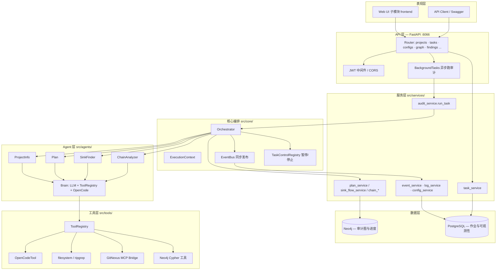
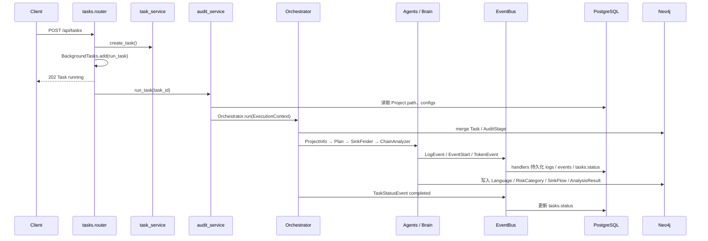
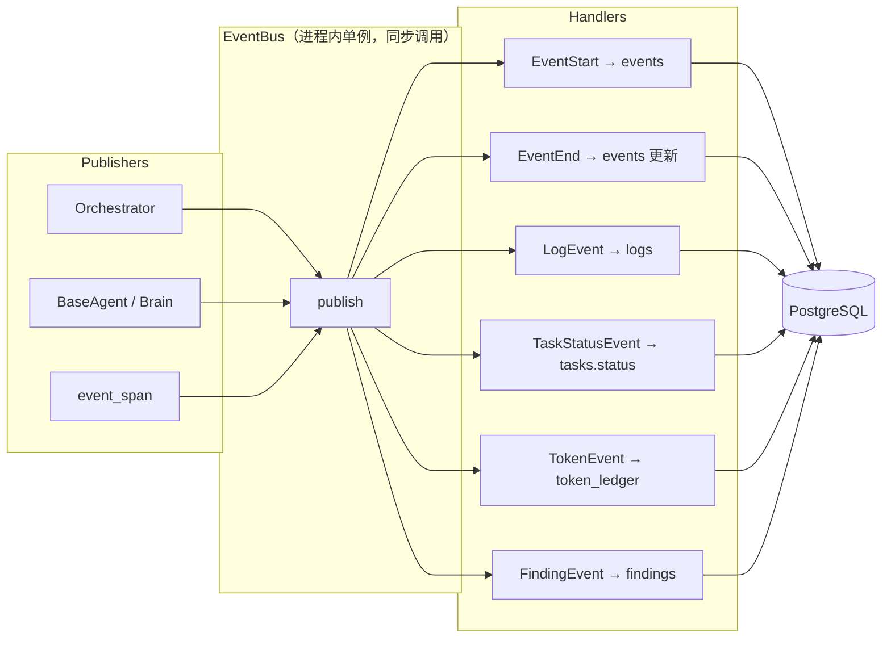
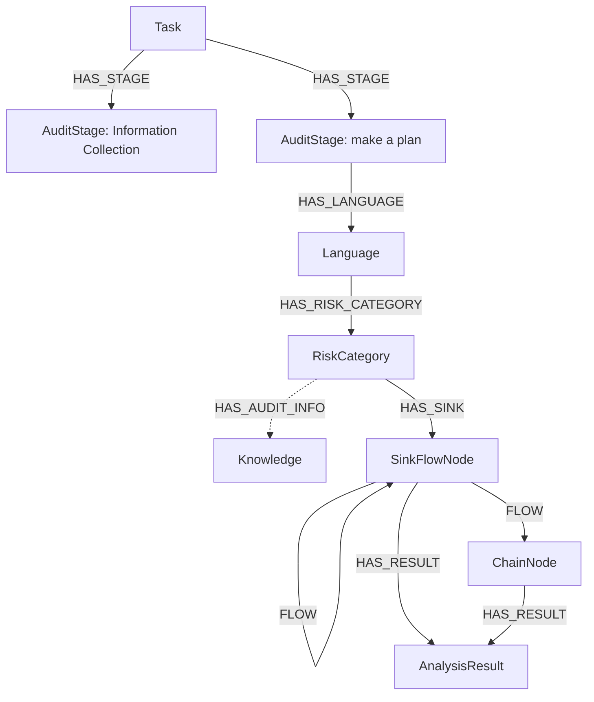
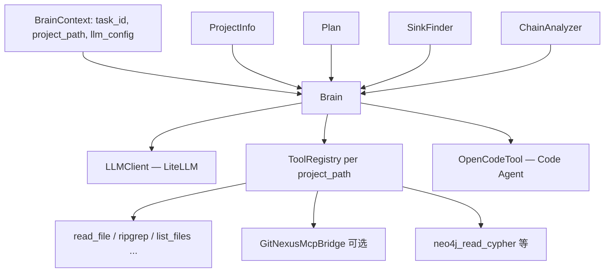
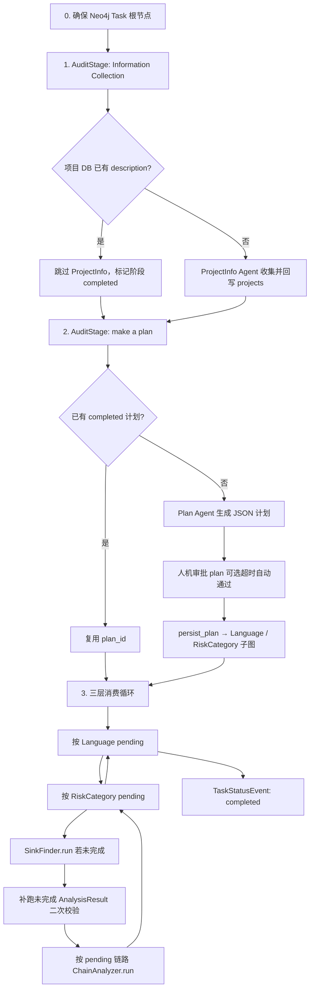
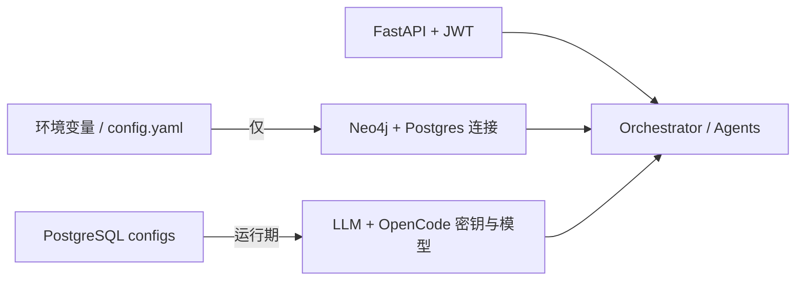

# ArgusMind

**ArgusMind** 是一套 AI 驱动的自主代码安全审计系统。它通过多 Agent 编排，对被测代码库进行结构化审计：收集项目信息、制定按语言与风险类别的审计计划、发现危险汇聚点（Sink）、追踪并分析调用链，最终将结果写入 **Neo4j** 图数据库与 **PostgreSQL** 关系库，并通过 **FastAPI** 对外提供 REST API。

## 界面预览

本仓库包含 **Web 控制台**（Ant Design Pro + Umi）。以下截图为 **Demo 模式**（`npm run start:demo`）下的界面，数据来自内置 Mock，无需连接后端即可浏览全流程。

<p align="center">
  
  &nbsp;
  
</p>
<p align="center"><sub>登录 · 控制台（Dashboard）</sub></p>

<p align="center">
  
  &nbsp;
  
</p>
<p align="center"><sub>项目管理 · 任务管理</sub></p>
<p align="center">
  
</p>
<p align="center"><sub>任务详情 · 代码审计链路图</sub></p>
<p align="center">
  
  &nbsp;
 
</p>
<p align="center"><sub>任务详情 · 漏洞管理</sub></p>

<p align="center">
  
  &nbsp;
  
</p>
<p align="center"><sub>漏洞详情（报告与代码审计链路图）</sub></p>


## 交流群

扫码加入微信 **ArgusMind交流群**，交流使用问题等。

<p align="center">
  
</p>

<p align="center"><sub>微信群二维码有时效（约 7 天）</sub></p>

## 快速开始

### Docker 安装

适用于 Linux / macOS / WSL，一键拉起 PostgreSQL、Neo4j 与前后端服务。

```bash
git clone https://github.com/pulseio76/ArgusMind.git
cd ArgusMind
chmod +x install.sh
./install.sh
```

安装完成后访问 **http://localhost:8006**（API 默认 **6066**）。默认账号 `ArgusMind` / `ArgusMind`，请在「配置管理」中填写 LLM 与 Code Agent 密钥。

### 源码安装

需自行准备 **Python 3.10+**、**Neo4j 5.x**、**PostgreSQL** 与 **Node.js**。

**1. 克隆仓库并安装 Python 依赖**

```bash
git clone https://github.com/pulseio76/ArgusMind.git
cd ArgusMind

python -m venv .venv
# Windows: .venv\Scripts\activate
# Linux / macOS: source .venv/bin/activate

pip install -e .
cp config.yaml.example config.yaml   # 按环境修改 Neo4j / PostgreSQL 连接
```

**2. 启动后端**

```bash
python src/main.py
```

默认监听 **http://0.0.0.0:6066**。首次启动会自动初始化数据库与默认用户（`ArgusMind` / `ArgusMind`）。

**3. 启动前端服务**

```bash
git submodule sync --recursive frontend
git submodule update --init --recursive frontend
cd frontend
git fetch origin main
git checkout --detach origin/main
npm install
npm run dev
```

前端开发服务启动后，按终端提示访问本地地址。

## 核心能力

- **端到端审计流水线**：`Orchestrator` 编排 `ProjectInfo` → `Plan` → `SinkFinder` → `ChainAnalyzer` 等 Agent，支持任务暂停、恢复与取消。
- **双存储架构**：Neo4j 承载审计阶段、语言、风险类别、Sink、链路等图关系；PostgreSQL 承载用户、任务、配置、日志、事件与漏洞发现等业务数据。
- **可观测性**：事件总线将运行日志、任务状态变更写入数据库，便于 Web 控制台或 API 查询进度。
- **工具链集成**：OpenCode（代码 Agent）、ripgrep、tokei、可选 GitNexus MCP；LLM 通过 [LiteLLM](https://github.com/BerriAI/litellm) 统一接入多种模型提供商。
- **REST API**：项目管理、任务启停、配置管理、图数据查询、报告导出、人工审批等。

## 技术栈


| 类别       | 技术                |
| -------- | ----------------- |
| 语言       | Python ≥ 3.10     |
| Web 框架   | FastAPI + Uvicorn |
| 图数据库     | Neo4j 5+          |
| 关系数据库    | PostgreSQL        |
| ORM      | SQLAlchemy 2.x    |
| LLM      | LiteLLM           |
| 代码 Agent | opencode-ai       |


## 系统架构

ArgusMind 采用 **分层 + 事件驱动 + 双库分工** 的设计：HTTP 层负责鉴权与任务调度；`Orchestrator` 驱动多 Agent 流水线；审计过程产生的 **图结构** 写入 Neo4j，**作业元数据、配置、日志、事件、发现** 写入 PostgreSQL；运行时通过内存 **事件总线** 解耦编排与持久化。

<p align="center">
  
</p>
<p align="center"><sub>系统架构总览（用户访问 → 调度服务 → 核心编排 → Agent → 工具 → 双库，及外部依赖）</sub></p>

下文各小节为分模块的 Mermaid 细化图，可与上图对照阅读。

### 总体分层



| 层级 | 目录 | 职责 |
|------|------|------|
| API | `src/api/` | 路由、JWT、异常、生命周期（`lifespan` 内 `init_db` + `init_clients`） |
| 服务 | `src/services/` | 业务规则、Neo4j 查询封装、任务/项目 CRUD |
| 核心 | `src/core/` | `Orchestrator` 流水线、`EventBus`、任务协作式暂停 |
| Agent | `src/agents/` | 各阶段 ReAct 式 LLM 对话与工具调用 |
| 工具 | `src/tools/` | 统一 `ToolResult`、OpenCode / ripgrep / GitNexus |
| 存储 | `src/storage/`、`src/infrastructure/db/` | Neo4j Repository、SQLAlchemy 模型与会话 |
| LLM | `src/llm/` | LiteLLM 封装与 JSON 解析 |

### 请求与任务执行路径

典型「创建并运行审计任务」的调用链如下：



要点：

- **同步编排、异步触发**：`POST /api/tasks` 通过 FastAPI `BackgroundTasks` 在后台调用 `audit_service.run_task`，HTTP 立即返回，审计在进程内同步执行至结束或暂停。
- **配置注入**：`run_task` 从 PostgreSQL `configs` 表加载 `LLM_config`、`code_agent_config`，构造 `ExecutionContext` 后交给 `Orchestrator`，不在编排器内读环境变量。
- **幂等与恢复**：Neo4j 节点普遍以 `(task_id, name)` 或 `node_id` 做 `MERGE`；任务恢复时可复用已完成的「信息收集」「制定计划」阶段，并从 `pending` 状态继续消费语言/风险类别/链路队列。

### 事件总线与可观测性

编排器与 Agent **不直接写库**，而是通过 `get_event_bus().publish(...)` 发布领域事件，由 `event_handlers.register_default_handlers()` 注册的 handler 落库：



| 事件类型 | 典型来源 | 持久化目标 |
|----------|----------|------------|
| `LogEvent` | Orchestrator、各 Agent | `logs` 表 |
| `EventStart` / `EventEnd` | LLM 轮次、工具调用、`event_span` | `events` + 详情 |
| `TaskStatusEvent` | 任务开始/完成/失败 | `tasks.status`、`finished_at` |
| `TokenEvent` | Brain / span 累计用量 | `token_ledger` |
| `FindingEvent` | 漏洞确认流程 | `findings` 相关表 |

Handler 异常会被总线捕获并记录，**不会中断审计主流程**，保证单点持久化失败不影响编排。

### Neo4j 审计图模型

审计进度与领域对象以 **有向图** 存储，便于按任务、语言、风险类别下钻查询（`/api/graph`、`/api/chain-graph`）。



| 节点标签 | 含义 |
|----------|------|
| `Task` | 一次审计运行的图根（`task_id`、项目路径等） |
| `AuditStage` | 流水线阶段（如 Information Collection、make a plan），含 `status` |
| `Language` | 计划中的目标语言 |
| `RiskCategory` | 该语言下的漏洞类型 / 风险类别 |
| `SinkFlowNode` / `ChainNode` | Sink 发现阶段构建的 FLOW 森林与链上节点 |
| `AnalysisResult` | `ChainAnalyzer` 对单条链路的判定结果 |
| `Knowledge` / `AuditInfo` | 风险类别关联的审计经验知识 |

主要关系：`HAS_STAGE`、`HAS_LANGUAGE`、`HAS_RISK_CATEGORY`、`HAS_SINK`、`FLOW`（多跳路径）、`HAS_RESULT`。

`plan_service` / `sink_flow_service` 通过 Cypher 维护 **待处理队列**（`fetch_next_pending_*`），`Orchestrator._drive_sink_and_chain` 按 **语言 → 风险类别 → 链路** 三层循环消费，并在节点上更新 `running` / `completed` / `pending`。

### PostgreSQL 数据职责

| 表/模型（节选） | 用途 |
|-----------------|------|
| `users` | 登录与 RBAC（JWT） |
| `projects` | 被测仓库路径、项目级 `description`（可复用跳过信息收集） |
| `tasks` | 任务状态机：`pending` / `running` / `paused` / `completed` / `failed` / `cancelled` |
| `configs` | LLM、Code Agent、JWT 密钥等运行配置 |
| `events` / `opencode_events` | 细粒度调用轨迹与 OpenCode 原始事件 |
| `logs` | 模块级运行日志 |
| `findings` | 对外展示的漏洞发现（与 Neo4j 图可关联查询） |
| `token_ledger` | Token 用量账本 |
| `human_interactions` | 计划等人机审批记录 |

**分工原则**：Neo4j 存「审计过程中生长出来的图」；PostgreSQL 存「谁、何时、跑了什么、花了多少 token、最终结论条目」。

### Agent 与 Brain

每个任务在编排开始时构造 **一个共享 `Brain` 实例**，供各 Agent 复用项目上下文与工具注册表：



- **`BaseAgent`**：封装 `_llm_step`（带重试与 JSON 校验）、`_execute_tool_call`，各阶段 Agent 继承并实现 `run()`。
- **`Brain`**：维护 `project_info` / `plan`、任务级 `tmp_dir`、人工审批 `wait_for_human_approval`、Git 仓库初始化与 GitNexus 分析入口。
- **工具调用约定**：`ToolRegistry.invoke` 始终返回结构化 `ToolResult` dict，Agent 根据 `success` / `error_code` 决定重试或换策略。

### 工具链

启动时 `ensure_tool_dependencies_at_startup()` 预检（失败仅告警，不阻断 API）：

| 工具 | 作用 |
|------|------|
| **OpenCode** (`opencode-ai`) | 代码级搜索、调用链追踪（SinkFinder / ChainAnalyzer 重度依赖） |
| **ripgrep** | 快速文本/符号搜索 |
| **tokei** | 代码行数统计（ProjectInfo） |
| **GitNexus MCP** | 可选；代码库符号/关系查询（`pip install -e ".[gitnexus]"`） |
| **Neo4j Cypher 工具** | Agent 只读查询当前任务图 |

被测代码路径来自 `projects.path`；Brain 会在该路径下初始化 Git 并可选触发 GitNexus analyze。

### 审计流水线（详细）

`Orchestrator.run(ctx)` 主流程：



**阶段说明**：

1. **信息收集**：`ProjectInfo` 通过 LLM + 工具分析仓库；若 `projects.description` 已存在则整阶段跳过。
2. **制定计划**：`Plan` 输出按 `languages[]` → `risk_categories[]` 的结构；经 `persist_plan` 展开为 Neo4j 子图；支持 **10 分钟人机审批**（`human_interactions`），超时默认自动通过。
3. **Sink 发现 + 链路分析**（核心循环）：
   - 外层：遍历计划中 `status=pending` 的 `Language`
   - 中层：遍历该语言下 `RiskCategory`
   - 内层：`SinkFinder` 写入 `HAS_SINK` → `FLOW` 森林后，逐条 `fetch_next_pending_sink_chain_path` 交给 `ChainAnalyzer`
   - 支持对未完成 `AnalysisResult` 的 **resume 二次校验**
4. **任务控制**：循环内多处调用 `ensure_task_running(task_id)`；暂停时抛 `TaskPausedError` 协作式退出，状态由 `TaskControlRegistry`（内存）与 `tasks.status`（库）共同维护。

### 配置与安全边界



- 浏览器 / 客户端 **不可** 直接拿到 LLM Key；仅通过已鉴权 API 间接使用。
- 临时文件目录：`{TMP}/ArgusMind/{task_id}/`，由 `globals.TMP_DIR` 与 `Brain` 共同使用。

## 环境要求

- **Python** 3.10 及以上
- **Neo4j** 5.x（默认 `bolt://127.0.0.1:7687`）
- **PostgreSQL**（建议单独建库 `argusmind`）
- **Node.js / npx**（OpenCode、GitNexus 等工具链；启动时会尝试自动检测/安装）
- **LLM API** 与 **OpenCode 服务**（配置写入数据库，见下文）
- 可选：**GitNexus**（安装 `pip install -e ".[gitnexus]"` 或 `mcp` 相关依赖）

## API 概览


| 前缀                               | 说明                       |
| -------------------------------- | ------------------------ |
| `/api/health`、`/api/ready`       | 健康检查                     |
| `/api/auth`                      | 登录、当前用户、改密               |
| `/api/projects`                  | 项目管理                     |
| `/api/tasks`                     | 任务 CRUD、运行/暂停/恢复/取消、批量操作 |
| `/api/findings`                  | 漏洞发现列表与详情                |
| `/api/events`                    | 审计事件、OpenCode 事件、人工审批    |
| `/api/logs`                      | 运行日志                     |
| `/api/configs`                   | LLM / Code Agent 配置      |
| `/api/chains`、`/api/chain-graph` | 调用链与图数据                  |
| `/api/graph`                     | 审计图查询                    |
| `/api/reports`                   | 任务报告                     |
| `/api/tokens`                    | Token 用量统计               |


除健康检查外，多数接口需要 JWT 认证（`Authorization: Bearer <token>`）。

## 项目结构

```
ArgusMind/
├── src/
│   ├── main.py              # CLI 入口，启动 Uvicorn
│   ├── config.py            # Neo4j / PostgreSQL 启动配置
│   ├── api/                 # FastAPI 路由与应用工厂
│   ├── core/                # Orchestrator、事件总线、状态机
│   ├── agents/              # 各审计 Agent 与 Prompt
│   ├── services/            # 业务服务层
│   ├── repositories/        # 数据访问
│   ├── infrastructure/      # DB、队列、安全
│   ├── storage/             # Neo4j / Postgres 仓储封装
│   ├── tools/               # OpenCode、ripgrep、MCP 等工具
│   └── llm/                 # LiteLLM 客户端与解析
├── tests/                   # 单元测试
├── test_dir/                # 脚本与集成测试辅助
├── docs/                    # 需求与设计文档
├── config.yaml.example      # 数据库连接配置样例
├── pyproject.toml
└── requirements.txt
```


## 许可证

MIT License — 详见 `pyproject.toml` 中的 license 字段。

## 相关链接

- OpenCode：[opencode-ai](https://pypi.org/project/opencode-ai/)
- LiteLLM：[BerriAI/litellm](https://github.com/BerriAI/litellm)
